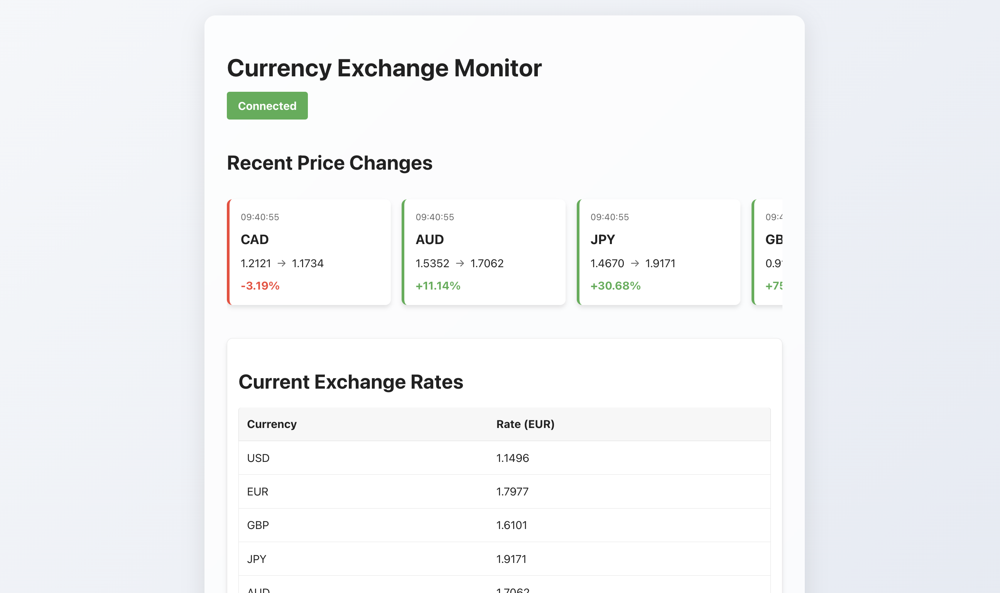

# Currency Exchange Monitor

A real-time currency exchange rate monitoring application that provides live updates of currency rate changes with a modern, interactive interface.



## Features

- Real-time currency exchange rate monitoring
- Visual history of recent price changes in a horizontal slider
- Automatic WebSocket reconnection on connection loss
- Visual connection status indicator

## Prerequisites

- Node.js (v14 or higher)
- npm
- Backend server running (see backend setup instructions)

## Setup Instructions

1. Clone the repository:

```bash
git clone <repository-url>
```

2. Install dependencies:

```bash
npm install
```

3. Create a `.env` file in the frontend directory:

```env
VITE_WS_URL=ws://localhost:3000
```

4. Start the development server:

```bash
npm run dev
```

5. Open your browser and navigate to `http://localhost:5173`

## Environment Variables

| Variable | Description | Default |
|----------|-------------|---------|
| VITE_WS_URL | WebSocket server URL | ws://localhost:3000 |

## Application Structure

- `src/App.jsx` - Main application component with WebSocket connection logic
- `src/components/`
  - `CurrencyTable.jsx` - Displays current exchange rates
  - `PriceChangeHistory.jsx` - Shows recent price changes in a slider

## Features in Detail

### Real-time Updates
The application connects to a WebSocket server to receive live currency exchange rate updates. When a rate changes significantly, it's displayed in the price history slider.

### Price History Slider
- Shows the last 10 price changes
- Color-coded cards (green for increases, red for decreases)
- Displays old price, new price, and percentage change
- Timestamp for each change

### Current Rates Table
Displays all current exchange rates in an easy-to-read table format.

### Connection Status
Visual indicator showing the current WebSocket connection status:
- Connected (green)
- Connecting (yellow)
- Disconnected (red)

## Development

Built with:
- React
- Vite
- WebSocket for real-time communication
- CSS3

## Building for Production

To create a production build:

```bash
npm run build
```

The build output will be in the `dist` directory.

## Troubleshooting

1. If you can't connect to the WebSocket server:
   - Ensure the backend server is running
   - Check that the VITE_WS_URL in .env matches your backend server address
   - Check browser console for connection errors

2. If you're not seeing updates:
   - Verify the backend is successfully fetching new rates
   - Check the browser console for any error messages
   - Ensure your network connection is stable

## Docker Deployment

### Prerequisites for Docker

- Docker installed on your machine
- Docker Compose (optional, but recommended)
- Backend service running (either locally or in Docker)

### Project Structure for Docker

```
frontend/
├── Dockerfile
├── docker-compose.yml
├── nginx.conf
├── .dockerignore
└── .env
```

### Quick Start with Docker

1. Build the Docker image:
```bash
docker build -t currency-monitor-frontend .
```

2. Run the container:
```bash
docker run -p 80:80 -e VITE_WS_URL=ws://your-backend-url currency-monitor-frontend
```

### Using Docker Compose

1. Create a `.env` file with your environment variables:
```env
VITE_WS_URL=ws://your-backend-url
```

2. Run with docker-compose:
```bash
docker-compose up -d
```

3. Stop the services:
```bash
docker-compose down
```

### Environment Variables in Docker

When running with Docker, you can set environment variables in multiple ways:
- Using the `.env` file with docker-compose
- Using the `-e` flag with docker run
- Using environment section in docker-compose.yml

### Production Deployment

For production deployment, make sure to:
1. Set the correct WebSocket URL for your backend
2. Use HTTPS for security
3. Configure proper CORS settings
4. Set up proper networking between frontend and backend containers

### Troubleshooting Docker Setup

1. If the container fails to start:
   - Check Docker logs: `docker logs <container_id>`
   - Verify port availability: Ensure port 80 is not in use
   - Check environment variables are properly set

2. If you can't connect to the backend:
   - Ensure the WebSocket URL is correctly set
   - Check network connectivity between containers
   - Verify the backend container is running

3. For permission issues:
   - Check file ownership in mounted volumes
   - Verify nginx has proper permissions to serve files

